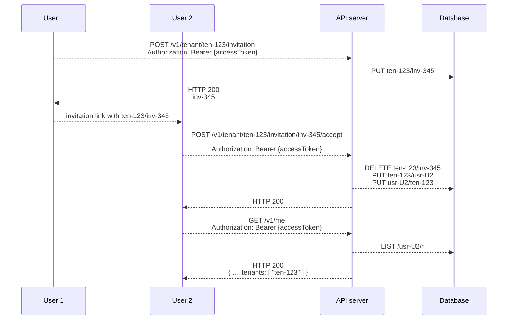

## Tenants and users

Most B2B applications have a concept of a _tenant_ which is separate from the concept of a _user_. LetsGo has first-class support for modeling tenants and users and their relationships, along with related concepts like subscription plans and invitations.

A _tenant_ is a unit of organization specific to the customer of the app. The concept may have different names depending on the domain of the app, for example, a _team\_\_, a \_project_, an _organization_, or a _workspace_.

A _user_ of the app has a unique identity from the [authentication](./authentication-authorization-and-trust.md) perspective. In practical terms, in the context of accessing the app's functionality through the browser, a user is a physical human being.

A _tenant_ may have multiple _users_. This represents a situation where multiple users have access to the same project, workspace, or team, and is a frequent pattern in B2B apps.

A _user_ in turn may have access to multiple _tenants_. For example, Fubar and Fubaz are companies that are customers of your app. They are different _tenants_ in your system. Now, John is a contractor who works for both Fubar and Fubaz. John is a _user_ in our app who can access either _tenant_ Fubar or _tenant_ Fubaz. The way this manifests itself in the UI presented to the user in the _web_ component is via the tenant selector dropdown:

LetsGo also helps you manage subscription plans. In the LetsGo model, a _tenant_ is at all times associated with a specific _plan_ which describes the parameters of the service the app offers to that tenant. A plan may be a _freemium_ plan or a paid plan associated with a Stripe subscription.

### Invitations

LetsGo supports an invitation mechanism using which one user with access to a specific tenant can invite another user. By accepting the invitation, the other user also gains access to the tenant.

**NOTE** For clarity of the illustration, the diagram above omits the browser component that intermediates between the users and the API server.

In the first step, user _U1_ with access to tenant _ten-123_ calls the _API_ to create an invitation. The server generates a random initation Id and stores it in the database associated with tenant _ten-123_. The invitations are stored with a TTL so that they automatically expire if not used within 24h. The server returns the generated invitation Id _inv-456_ to user _U1_.

User _U1_ forms an invitation link that directs the browser to the _web_ component and sends it over to user _U2_ using proprietary channels (e-mail, Slack).

User _U2_ navigates to the invitation link in the browser and is asked to log in. Then, he sends a request to the _API_ server to accept the invitation. The _API_ server validates the invitation still exists in the database and then creates the association between user _U2_ and tenant _ten-123_ in the database.

In the last step, the new user _U2_ calls the `/v1/me` endpoint on the _API_ server, which looks up the database to determine the list of tenants to which user _U2_ has access and returns that list in the response.

### Plans and subscriptions

Read more about the relationship between tenants and subscription plans in [Manage the pricing model](../how-to/manage-the-pricing-model.md).

### Database and API

LetsGo maintains a number of database categories to support the tenancy model. You can read more about in [System database categories](../reference/system-database-categories.md).

LetsGo also implements a number of HTTP APIs in the _API_ component in support of the tenancy model. You can read more about in [Develop the API](../how-to/develop-the-api.md).

### Related topics

[Develop the API](../how-to/develop-the-api.md)  
[System database categories](../reference/system-database-categories.md)  
[Authentication, authorization, and trust](./authentication-authorization-and-trust.md)
