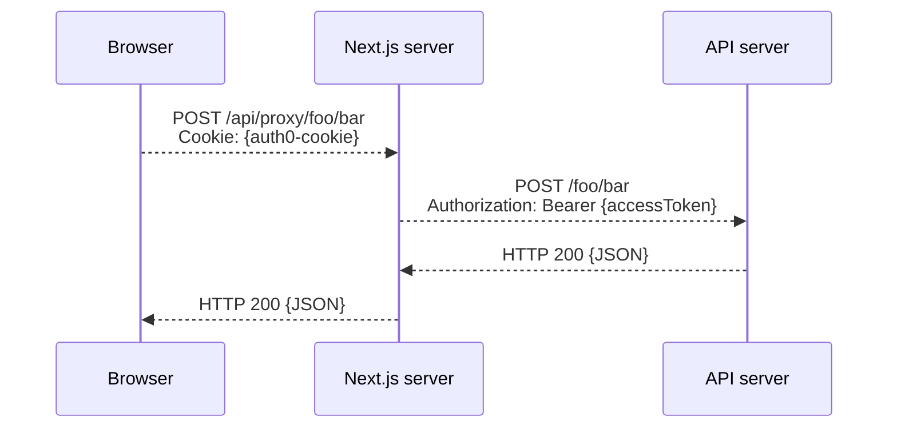
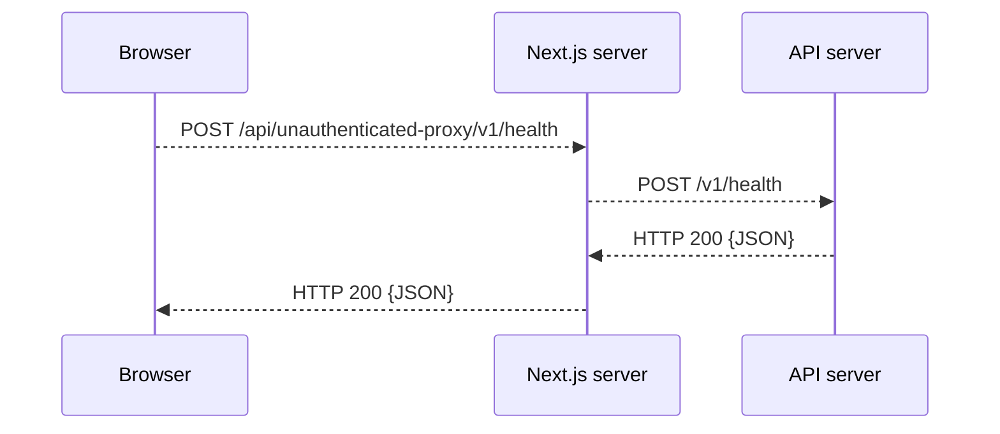

## Develop the front-end

The _web_ component of the LetsGo boilerplate implements the front-end of your application. This includes two aspects: your public website (landing page, pricing page, etc.), and the management dashboard for your customers (managing tenants, users, any settings specific to active subscriptions to your app).


This article assumes you have [integrated with Auth0 to enable user authentication](../tutorials/setting-up-authentication-with-auth0.md) and [integrated with Stripe to process payments](../tutorials/setting-up-payments-with-stripe.md).

### Technology

The _web_ component is a [Next.js](https://nextjs.org/) application implemented in [TypeScript](https://www.typescriptlang.org/). It is based on the [Next.js's App Router](https://nextjs.org/docs/app) paradigm.

The boilerplate LetsGo provides does not rely on any specific React UI framework. All components are implemented in plain HTML with minimal inline styling. The focus is on designing the right routing structure and logic with the expectation you will bring your own UI framework to create a branded experience.

When [running locally](./run-locally.md), the _web_ component is hosted as a plain [Node.js]() http server on `http://localhost:3000`.

When you [deploy your app to AWS](../tutorials/first-deployment-to-aws.md), the _web_ component is packaged as a [Docker](https://www.docker.com/) image and deployed using [AWS App Runner](https://aws.amazon.com/apprunner/).

### Layout, paths, and components

The _web_ component code resides in the `app/web` directory. Here are the key subdirectories and their purpose:

- `app/web/public` stores any static files that will be deployed with your app.
- `app/web/scripts` contains devops scripts for the _web_ component.
- `app/web/src/components` contains reusable React components that implement the LetsGo boilerplate logic. These are implemented in plain HTML and are meant to be refactored using the React UI framework of your choice.
- `app/web/src/app` is the root directory of the [Next.js's App Router]().

The subdirectory tree below `app/web/src/app` reflects the routing paths of the React app itself. The LetsGo boilerplate organizees the font-end into two main logical areas:

- `app/web/src/app/(site)` contains your public website (landing pages, pricing pages, contact form etc).
- `app/web/src/app/(dashboard)` contains the management dashboard for your customers. This part of the website requires user authentication.

These are the individual pages included in the LetsGo boilerplate:

- `app/web/src/app/(site)` this is the landing page of your website.
- `app/web/src/app/(site)/pricing` the pricing page.
- `app/web/src/app/(site)/contact` the contact form. See [Process the contact form](./process-the-contact-form.md) for details.
- `app/web/src/app/(dashboard)/manage` the root path of the management dashboard. The `layout.tsx` in this location enforces user authentication for all subordinate paths.
- `app/web/src/app/(dashboard)/manage/settings` management of settings specific to the logged in user.
- `app/web/src/app/(dashboard)/manage/[tenantId]/settings` management of settings specific to a particular tenant of your app. This is where subscriptions, billing, and team membership is managed. Read more about how [tenants and user](../backgound/tenants-and-users.md) are related.
- `app/web/src/app/(dashboard)/manage/[tenantId]/newplan` selection of a new subscription plan for an existing tenant.
- `app/web/src/app/(dashboard)/manage/[tenantId]/newplan/[planId]` confirmation of the intention to change to a new subscription plan for an existing tenant.
- `app/web/src/app/(dashboard)/manage/[tenantId]/paymentmethod` updating the payment method for a paid Stripe subscription of an existing tenant.
- `app/web/src/app/(dashboard)/manage/[tenantId]/paymentmethod/processing` (rarely used) confirmation of a payment processing that requires a prolonged validation on the Stripe side.
- `app/web/src/app/(dashboard)/join/[tenantId]/[invitationId]` allows users to join a tenant using an invitation link.

In addition to the routes that serve UI, LetsGo also includes two [API routes](https://nextjs.org/docs/pages/building-your-application/routing/api-routes):

- `app/web/src/app/(dashboard)/api/auth` is used by Auth0 to support user login and logout.
- `app/web/src/app/(dashboard)/api/proxy` is used to make authenticated API requests to the _API_ component.
- `app/web/src/app/(dashboard)/api/unauthenticated-proxy` is used to make anonymous API requests to the _API_ component.

The purpose of the last two routes is described in more detail [below](#server-logic-and-calling-the-apis).

### Get authenticated user

Information about the authenticated user can be obtained using the `useUser` hook provided by the Auth0 SDK. This hook can be used in either the dashboard or the public website portion of the front-end, since a logged in user can explicitly or implicitly navigate between these two sections of the front-end.

Here is a simple example of using the `useUser` hook:

```tsx
"use client";

import { useUser } from "@auth0/nextjs-auth0/client";

export function MyComponent() {
  const { user, error, isLoading } = useUser();
  if (isLoading) return <div>Loading...</div>;
  if (error) throw error;
  if (user) {
    // The user is logged in
    return <div>Hello, {user.name}!</div>;
  } else {
    // The user is not logged in
    return <div>Hello there!</div>;
  }
}
```

### Get tenants and current tenant

A logged in user can manage one or more tenants they have permissions to (read more about tenants and users [here](../backgound/tenants-and-users.md)). LetsGo provides the `useTenant` hook to determine the set of tenants the user has access to as well as the current tenant selected in the dashboard.

Here is a simple example of using the `useTenant` hook:

```tsx
"use client";

import { useTenant } from "components/TenantProvider";

export function MyComponent() {
  const { currentTenant, tenants, error, isLoading } = useTenant();
  if (isLoading) return <div>Loading...</div>;
  if (error) throw error;
  if (currentTenant && tenants) {
    // The user is logged in
    return (
      <div>
        <p>Current tenant: {currentTenant.displayName}</p>
        <p>Subscription plan: {currentTenant.plan.planId}</p>
        <p>
          Other available tenants:{" "}
          {tenants.map((t) => t.displayName).join(", ")}
        </p>
      </div>
    );
  } else {
    // The user is not logged in
    return <div>Log in to see the tenant information</div>;
  }
}
```

### Server logic and calling the APIs

LetsGo recommends you [implement all your server side application logic in the _API_ component](./develop-the-api.md). While Next.js supports simple server side endpoints using [API routes](https://nextjs.org/docs/pages/building-your-application/routing/api-routes), LetsGo recommends you don't use this feature to avoid the fragmentation or duplication of your server side logic between the _web_ and _API_ components, and to allow the _web_ component to run with limited permissions.

To facilitate calling the endpoints of the _API_ component from the browser, LetsGo boilerplate provides two [API routes](https://nextjs.org/docs/pages/building-your-application/routing/api-routes): `app/web/src/app/(dashboard)/api/proxy/[...path]`, and `app/web/src/app/(dashboard)/api/unauthenticated-proxy/[...path]`. These Next.js's endpoints simply proxy incoming requests to the _API_ component. In addition, the first of those routes adds a JWT access token of the currently logged in user to the upstream requests to the _API_ component. This removes the need for this access tokens to be handled by the browser, which increases security.

This is the end to end flow of the recommended way of calling **authenticated** _API_ endpoints from the client code running in the browser:



This is the end to end flow of the recommended way of calling **unauthenticated** _API_ endpoints from the client code running in the browser:


