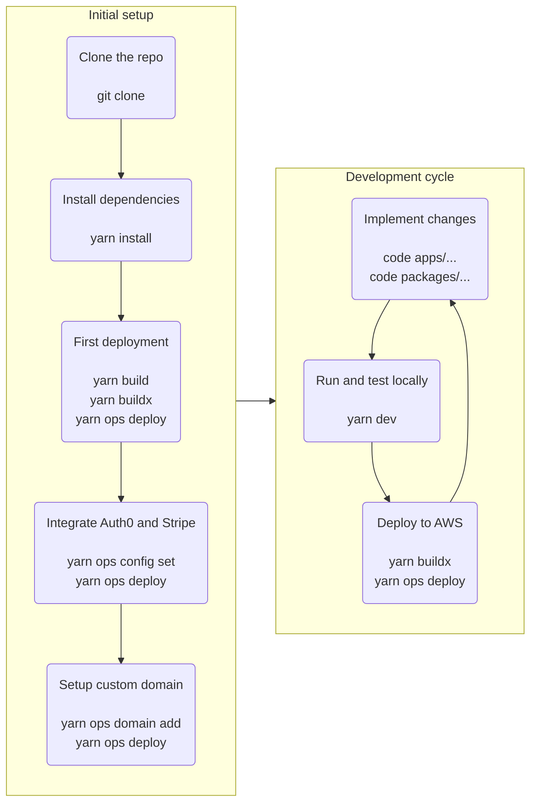

## How to use LetsGo?

LetsGo is organized as a monorepo. Using LetsGo means cloning the repository and then modifying it to implement your own application. In the course of the development, you will be modifying the boilerplate code of the three major components included in the monorepo: the website, the HTTP API, and the worker. You will be also using the devops tool included in the repository to help manage the development lifecycle: deploy the application to AWS, manage production/stage environments, manage configuration, etc.

This is the high level flow of the steps you will follow when working with LetsGo along with the commands you will use:

The [First deployment to AWS](../tutorials/first-deployment-to-aws.md) tutorial covers the _Clone the repo_, _Install dependencies_, and _First deployment_ steps. The [Setting up authentication with Auth0](../tutorials/setting-up-authentication-with-auth0.md) shows how to integrate Auth0, and [Setting up payments with Stripe](../tutorials/setting-up-payments-with-stripe.md) walks you through integration with Stripe. Finally, [Configuring a custom domain](../tutorials/configuring-custom-domain.md) shows you how to host LetsGo in AWS using your own domain name.

The [Develop the frontend](./develop-the-frontend.md), [Develop the API](./develop-the-api.md), and [Develop the worker](./develop-the-worker.md) provide a good start point for writing code specific to your application. There are also many more specific [How-to](../README.md) topics relevant to specific aspects of development. The [Building and running locally](../tutorials/building-and-running-locally.md) tutorial show you how to run and test your app on your devevelopment machine. The [Re-deploying to AWS](../tutorials/re-deploying-to-aws.md) walks you through the deployment of the local changes you made to AWS.
