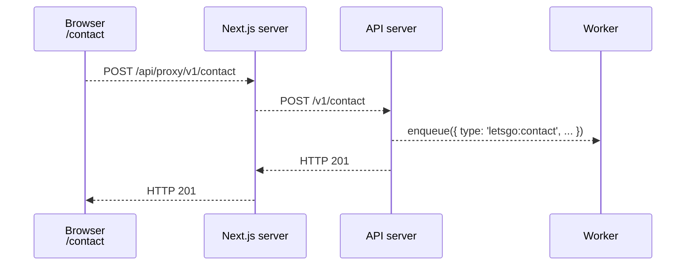

## Process the contact form

The _web_ component contains a contact form your customer can fill out to request more information.

The LetsGo boilerplate provides the mechanics of the form submission and data collection, but it does not provide the actual logic to decide what to do with the submitted data. You would normally want to use this data to update your CRM system or otherwise trigger the sales team to act on it.

This article shows you how to implement that custom submission processing logic. It assumes you have read about how to [develop the worker](./develop-the-worker.md).

### Contact form processing

The UI of the contact form is implemented in the _web_ component at [apps/web/src/app/(site)/contact/page.tsx](<../../apps/web/src/app/(site)/contact/page.tsx>) and hosted on the `/contact` path of the website. The page is meant to be redirected to either using client-side routing or HTTP. The LetsGo boilerplate redirects to the contact form from two locations: the _Contact_ link in the navbar and the _Call Us_ button of the _Custom_ pricing plan on the pricing page and the switching plans page.

Whenever you are redirecting to the contact form from other locations of your app, you can include any contextual information you want to capture as the query parameters of the URL, e.g. `/contact?from=pricing&tenantId=ten-123`. These query parameters are included in the form submission.

When the contact form is used from an authenticated context (i.e. when a user is logged in), the submission will automatically include the information about the current tenant and the authenticated user making the submission.

When the form is submitted, the data is first sent from the _web_ component to the _API_ component using the `POST /v1/contact` endpoint, and then enqueued for asynchronous processing by the _worker_ as the `letsgo:contact` message type. The worker dispatches the processing of the message to the [apps/worker/src/handlers/contactHandler.ts](../../apps/worker/src/handlers/contactHandler.ts).

The default implementation of the `contactHandler.ts` sends a formatted message to Slack, as long as the [Slack notifications are enabled](./send-notifications-to-slack.md).

### Implement custom contact form processing logic

To implement custom processing logic for the contact form, modify the implementation of the [apps/worker/src/handlers/contactHandler.ts](../../apps/worker/src/handlers/contactHandler.ts), then [test locally](./run-locally.md) and [re-deploy the worker component](../tutorials/re-deploying-to-aws.md).

### Related topics

[Develop the worker](./develop-the-worker.md)  
[Develop the frontend](./develop-the-frontend.md)  
[Enqueue asynchronous work](./enqueue-asynchronous-work.md)
